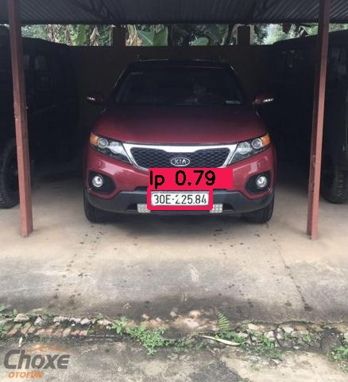

# LP Detection README

Welcome to the LP Detection project! This repository contains code and resources for License Plate (LP) detection using advanced computer vision techniques. Whether you're interested in exploring the requirements, trying out the demo, or diving into the references, you'll find everything you need here.

## Requirements

To run the LP detection code successfully, you'll need the following dependencies:

- onnxruntime (>= 3.6)
- opencv (>= 4.0)
- [Pre-trained LP detection model](./models/lp-n.onnx)

You can install the required onnxruntime at [this link](https://onnxruntime.ai/docs/build/inferencing.html).

## Demo 

To run the demo, follow these steps:

1. Create a build directory: `mkdir build`
2. Navigate to the build directory: `cd build`
3. Configure the project: `cmake ..`
4. Build the project: `make`
5. Run the demo: `./Yolov8OnnxRuntimeCPPInference`

## Results

  
  
  
  

  
  
  
  

## Reference 

- YOLOV8: [https://github.com/ultralytics/ultralytics.git](https://github.com/ultralytics/ultralytics.git)
- ONNXRUNTIME: [https://github.com/ultralytics/ultralytics.git](https://github.com/ultralytics/ultralytics.git)

For any questions or issues, please contact the author at [thanhlnbka@gmail.com](mailto:thanhlnbka@gmail.com).

---
*Disclaimer: This project is for educational and research purposes. The accuracy of the detection results may vary based on the quality of input images and the specific model used.*
